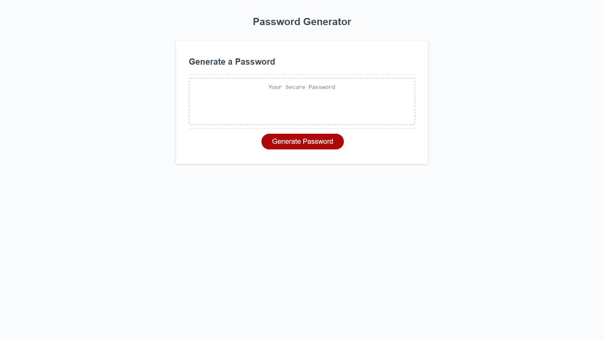

# Random Password Generator
## Contents
The password generator was made with (primarily) JavaScript, utilizing variable arrays to generate random passwords by concatenating strings and randomizing them. 

## Challenges and Lessons Learned
The application encounted a few issues initally with assinging the arrays as constants as opposed to variables, making them less flexible and thus unable to be properly generate a password. Assinging boolean values to characters allowed for the prompts to decide which collections should be concatenated, this initally opened up more troubleshooting steps as the additional steps created more syntactic errors.

## Application
You can find the deployed application at: https://nikolasmazur.github.io/password-generator/.

After hosting on GitHub Pages the site should look like this:

